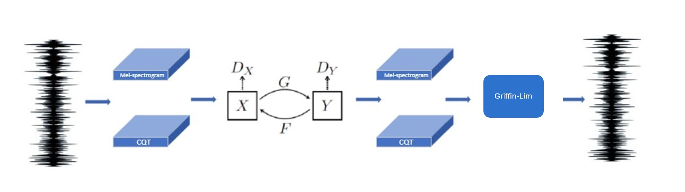
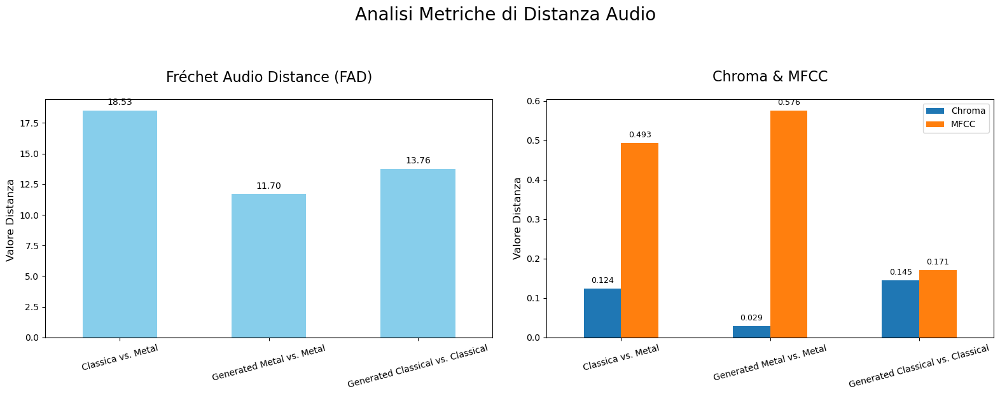

# Dilated_CycleGan_Music_Translation

# Trasferimento di Stile Musicale con CycleGAN

Questo repository contiene il codice sorgente per un progetto di trasferimento di stile musicale che utilizza un'architettura CycleGAN modificata. L'obiettivo è trasformare un brano musicale da un genere all'altro, preservando la sua struttura fondamentale. Nello specifico, questo progetto si concentra sulla trasformazione tra **musica Classica** e **Metal**.

Il modello è stato addestrato sul dataset **GTZAN** e sfrutta una rappresentazione audio a doppio canale che combina **Mel-spettrogrammi** e **Constant-Q Transform (CQT)** per catturare sia le caratteristiche timbriche che quelle armoniche.

Un notebook dimostrativo (`Demo.ipynb`) è incluso per illustrare l'intero processo, dalla preparazione dei dati alla generazione di audio.

## Caratteristiche Principali

- **Architettura CycleGAN Adattata**: Il modello si basa su una CycleGAN con modifiche specifiche per il dominio audio.
- **Rappresentazione Spettrale Duale**: L'input del modello è uno spettrogramma a 2 canali (128x512x2) che combina Mel-spettrogrammi (per le caratteristiche percettive) e CQT (per la struttura armonica).
- **Generatore**:
    - Struttura U-Net per preservare i dettagli.
    - Blocchi ResNet con **convoluzioni dilatate asimmetriche** nel bottleneck per catturare dipendenze temporali a diverse scale.
    - Integrazione di moduli **Squeeze-and-Excitation** per la pesatura adattiva dei canali.
- **Discriminatore PatchGAN**:
    - Architettura PatchGAN per la classificazione di "patch" locali dello spettrogramma.
    - **Normalizzazione Spettrale** per stabilizzare il training.
- **Strategie di Training Ottimizzate**: Include l'uso di LSGAN, scheduling del learning rate e dell'identity loss, e tecniche di regolarizzazione del discriminatore per una convergenza stabile.

## Pipeline del Progetto

Il processo completo di trasformazione è illustrato nel diagramma seguente e implementato nel codice:

1.  **Preprocessing**: I file audio vengono segmentati, trasformati in rappresentazioni Mel/CQT e normalizzati.
2.  **Training**: La CycleGAN viene addestrata a tradurre tra i domini Classica e Metal.
3.  **Post-processing**: Gli spettrogrammi generati vengono riconvertiti in segnali audio utilizzando l'algoritmo di **Griffin-Lim**.




## Struttura del Repository

```
.
├── demo.ipynb                # Notebook dimostrativo con l'intero processo
├── src/
│   ├── preprocessing/
│   │   └── preprocessing.py    # Script per la preparazione dei dati
│   ├── loading/
│   │   └── dataLoader.py       # Loader per il dataset
│   ├── models/
│   │   ├── generator.py        # Architettura del Generatore
│   │   ├── discriminator.py    # Architettura del Discriminatore
│   │   └── cycleGan.py         # Modello CycleGAN completo
│   ├── postprocessing/
│   │   └── reconstructor.py    # Script per la ricostruzione audio
│   └── evaluation/
│       └── evaluate.py         # Script per le metriche di valutazione
├── requirements.txt          # Dipendenze del progetto
└── README.md                 # Questo file
```

## Installazione e Setup

1.  **Clona il repository:**
    ```bash
    git clone https://github.com/elia-guglielmi/Dilated_CycleGan_Music_Translation.git
    cd https://github.com/elia-guglielmi/Dilated_CycleGan_Music_Translation.git
    ```

2.  **Installa le dipendenze:**
    Si consiglia di creare un ambiente virtuale. Le librerie principali utilizzate sono TensorFlow, Librosa, Scipy e Scikit-learn.
    ```bash
    pip install -r requirements.txt
    ```

3.  **Scarica il Dataset:**
    Questo progetto utilizza il [GTZAN Dataset](https://www.kaggle.com/datasets/andradaolteanu/gtzan-dataset-music-genre-classification).

## Come Usarlo

Il modo più semplice per iniziare è eseguire il notebook `demo.ipynb`. Questo ti guiderà attraverso:
1.  Caricamento e preprocessing di un campione audio.
2.  Caricamento dei modelli pre-addestrati.
3.  Esecuzione della trasformazione di stile.
4.  Ricostruzione e salvataggio del file audio trasformato.

Per eseguire l'intero processo da zero (preprocessing, training, valutazione):

## Risultati della Valutazione

L'efficacia del modello è stata misurata con metriche di distanza adatte a segnali audio:

-   **Fréchet Audio Distance (FAD)**: I risultati mostrano che l'audio trasformato è significativamente più vicino (in termini di FAD) al genere di destinazione rispetto al genere di partenza.
-   **Distanza MFCC e Chroma**: L'analisi ha rivelato una specializzazione complementare:
    -   **Classica → Metal**: Eccellente nel trasformare le **caratteristiche armoniche** (distanza Chroma -76%).
    -   **Metal → Classica**: Eccellente nel trasformare le **caratteristiche timbriche** (distanza MFCC -65%).

Questi risultati indicano che il modello apprende e trasferisce con successo le caratteristiche distintive di ciascun genere.

